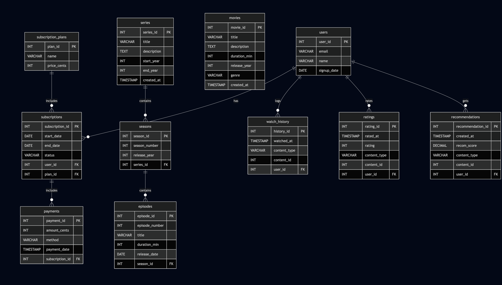

# Design Document

## Netflix - Style Streaming Platform

## Scope

In this section you should answer the following questions:

Purpose: This database is designed to support a Netflix-style streaming platform. Its primary goal is to track users, subscription plans, payments and on-demand content (movies and series), as well as user interactions such as watch history, ratings, and personalized recommendations. This schema enables both transactional operations (e.g. signing up, payment processing) and analytical queries (e.g. top-watched titles, user engagement metrics)

#### In scope:

* Users: acount information, signup date
* Subscription Plans: tiers,pricing
* Subscription & Payments: start / end dates, status, payment history
* Content:
    - Movies: standalone films with metadata (title, genre, runtime, release year)
    - Series: TV shows composed of seasons and episodes
* User Interaction:
    - Watch History: timestamped playback events (polumorphic association to movie or episode)
    - Ratings: user star ratings for content
    - Recommendations: precomputed suggestion scores per user (from 0.00 to 1.00)

#### Out of scope:

* User social interactions (friends, messaging)
* Detailed device tracking (browser, device ID)
* Content metadata beyond basic fields (cast, crew, subtitles, languages)
* Profile management beyond basic name / email
* Geographic content licensing restrictions

## Functional Requirements

#### Users should be able to:

1) Register and manage their account (email, name, subscription upgrades / downgrades)
2) View available subscription plans and subscribe to a plan
3) Make payments for subscriptions, stored with timestamps
4) Browse and Search content by attributes (title, genre, release year)
5) Play content, with each playback logged by watch history
6) Rate content and recieve recommendations based on algorithmic scores
7) Query summary information:
    - Top watched content (movies and series)
    - Personalized recommendations
    - Revenue and subscription metrics
    - Historical playback and ratings

#### Beyond scope:
* Real time streaming protocols
* Content upload pipelines
* Social features (comment, sharing)

## Representation

### Entities

* users: user_id, email, name, signup_date
Core user identity, unique constraints for email

* subscription_plans: plan_id, name, price_cents
Pricing tiers must ne unique, priced in cents to avoid float errors

* subscriptions: subscription_id, start_date, end_date, status, user_id (FK), plan_id (FK)
Tracks each users plan over time. status allows cancelation

* payments: payment_id, amount_cents, method, payment_date, subscription_id (FK)
Chronological payment events. timestamp for auditing

* movies: movie_id, title, description, duration_min, release_year, genre, created_at
Standalone content. created_at for recently added

* series: series_id, title, description, start_year, end_year, created_at
Show-level metadata. end_year null if ongoing

* seasons: season_id, season_number, release_year, series_id (FK)
One to many with series. composite unique constraint

* episodes: episode_id, episode_number, title, duration_min, release_date, season_id (FK)
One to many with season. unique numbering per season

* watch_history: history_id, content_type, content_id, watched_at, user_id (FK)
Polymorphic association to movie or episode. logs playback

* ratings: rating_id, content_type, content_idm rating, rated_at, user_id (FK)
Polymorphic rating. ensures 1-5 scale, one per user / content

* recommendations: recommendation_id, content_type, content_id, recom_score, created_at, user_id (FK)
Precomputed scores for fast retrieval

#### Atribute types & constraints:
* SERIAL/IDENTITY for primary keys ensures uniqueness and auto- increment
* VARCHAR(n) for bounded text (email, titles), TEXT for unbounded descriptions
* TIMESTAMP for precise event logging, DATE for dates without time
* CHECK constraints on content_type and rating ranges enforce data integrity

### Relationships

#### Relationship diagram

1) User <-> Subscriptions: one-to-many (a user can have multiple subscriptions over time)
2) Subscriptions <-> Payments: one to many (each subscription can have many payment events)
3) Series -> Seasons -> Episodes: hierarchical one to many chain
4) Watch History, Ratings, Recommendations: each links a user to a piece of content (movie or episode) via a polymorphic pattern
5) Movies are standalone. episodes link back to series via seasons

## Optimizations

* Indexes:
    1) CREATE INDEX idx_episodes_season ON episodes(season_id, episode_number); : fast episode lookups per season
    2) CREATE INDEX idx_seasons_series ON seasons(series_id, season_number); : quick season retrieval for a series
    3) CREATE INDEX idx_movies_year_genre ON movies(release_year, genre); : supports filtering / sorting by year and genre

* Views:
    1) vw_top_movies  : Top 10 movies by watch count
    2) vw_top_series  : Top 10 series by aggregated episode views

## Limitations

* Polymorphic associations are not strictly enforced by foreign keys. content_id validity must be checked at the application
* No soft-delete tracking for audit or archival. deleted rows are removed permanently
* No granular device / location data for playback events. may limit fine-grained analytics
* Recommendation logic is precomputed. dynamic real-time recommendation updates are outside this desigh scope
* Partitioning not implemented. very large watch_history tables may degrade performance over time without partitioning
